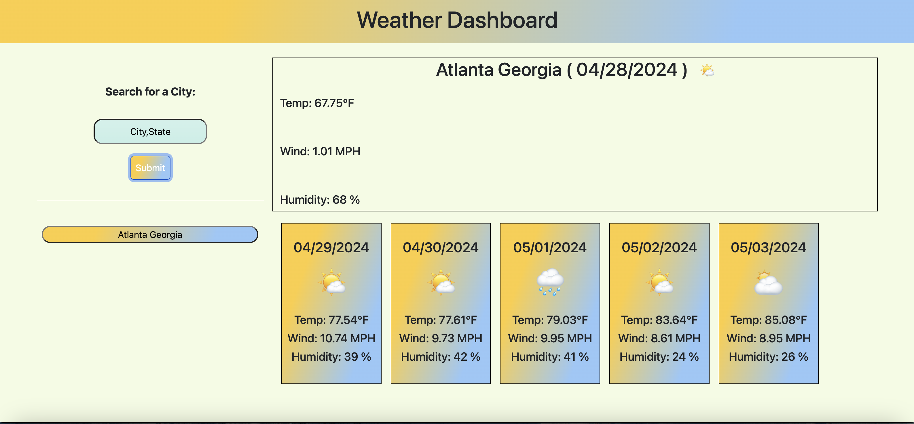

# Weather Dashboard
 A repo for my week 5 challenge at Vanderbilt University. The purpose of this repo to is introduce me server side API's and their usage. 

 ## Table of Contents 

N/A

## Usage 
To use this service all you have to do is type in a city and state seperated by a comma. There must not be a space after the comma.

 Valid ex. atlanta,georgia 
 queens,new york

 Invalid ex. atlanta, georgia 
 queens, new york 

 In later development, we will add another input field so city and state are separated. 

Please try for yourself:
 https://aakabia.github.io/Challenge6/

 

## Credits:

N/A

## License 
MIT Licsense 